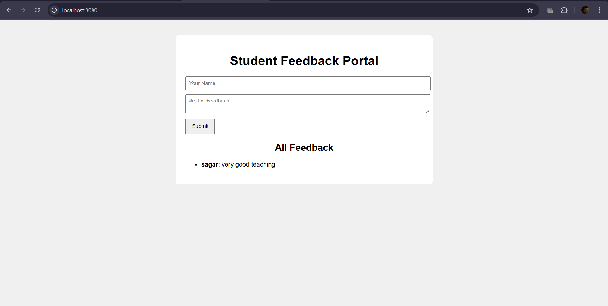
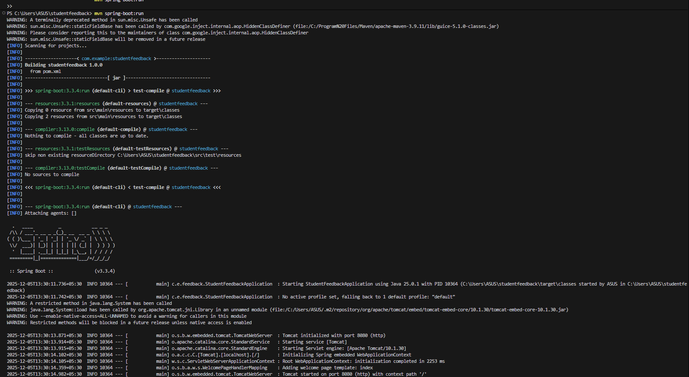

# Student Feedback Portal

A simple and clean web application built using Java, Spring Boot, and Maven.
This project allows students to submit feedback through a form and displays all submissions dynamically on the same page.

No external server or database is required — the app runs on an embedded Tomcat server included with Spring Boot.

## Features

Students can submit feedback (name + message)
All feedback entries displayed in real time
In-memory storage (no DB needed)
Spring MVC architecture
Thymeleaf template engine for dynamic UI
Fully runnable using a single Maven command

## Technologies Used

- Java 17
- Spring Boot 3
- Maven 3.9+
- Thymeleaf
- Embedded Tomcat Server

## Screenshot of OUTPUT



## Project Structure
```bash 
student-feedback
 ├── pom.xml
 └── src
     └── main
         ├── java
         │   └── com.example.feedback
         │       ├── StudentFeedbackApplication.java
         │       ├── Feedback.java
         │       └── FeedbackController.java
         └── resources
             ├── templates
             │   └── index.html
             └── static
                 └── style.css
```

## How to Run the Application
1. Clone the repository
```bash
git clone https://github.com/YOUR-USERNAME/student-feedback-portal.git
cd student-feedback-portal
```

2. Run the Spring Boot application
```bash
mvn spring-boot:run
```

3. Open in your browser
Open this URL:
```bash
http://localhost:8080
```

You will see the Student Feedback Portal interface.

## Build a JAR (Optional)

To build an executable JAR file:
```bash
mvn clean package
```

Run the JAR:
```bash
java -jar target/student-feedback-1.0.0.jar
```

## What You Will Learn

- How to build a real-world web application
- How Spring Boot handles routing & MVC
- How to create dynamic pages with Thymeleaf
- How to structure a Maven-based project
- Basics of backend + frontend integration

## Contributing

Feel free to fork this project and improve it.
Pull requests are welcome.

## License

This project is open-source and free to use for learning or personal development.